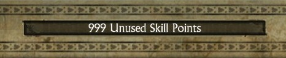

Titan Quest Mutator
===================

**A simple savegame editor for Titan Quest AE**

Mostly build as a proof of concept and for getting familiar with the Compose desktop framework.

Currently it is possible to edit the following values:
- [x] Character name
- [x] Gold
- [x] Available attribute points
- [x] Available skillpoints

  
-> *get yourself some attributes* <-

  
-> *get yourself some skillpoints* <-

***Disclaimer: This application alters your savefile and may corrupt it. It is strongly recommend to make backups of your savefile. Use at your own risk***

*Dual-licensed under MIT or Apache 2.0*
