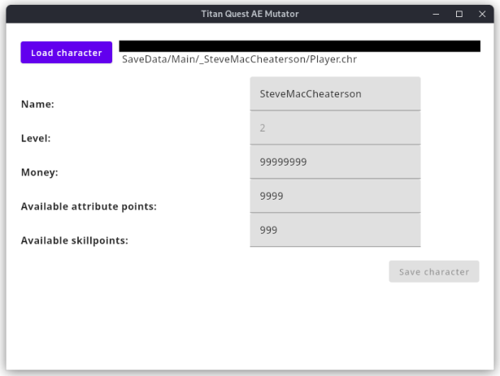

Titan Quest Mutator
===================

**A simple savegame editor for Titan Quest AE**

Mostly build as a proof of concept and for getting familiar with the Compose desktop framework.

Currently it is possible to edit the following values:
- [x] Character name
- [x] Gold
- [x] Available attribute points
- [x] Available skillpoints

### How to use
1. Quit Titan Quest (this is important, do not use while game is running)
2. Start 'Titan Quest Mutator'
3. Click 'Load character' and select your savefile (`%USERPROFILE%\Documents\My Games\Titan Quest - Immortal Throne\SaveData\<_CharacterName>\Player.chr`)
4. Edit values as desired
5. Click 'Save character' to write the changes to the savefile

### Example
  

### Result in-game
  

  

***Disclaimer: This application alters your savefile and may corrupt it. It is strongly recommend to make backups of your savefile. Use at your own risk***

*Dual-licensed under MIT or Apache 2.0*
